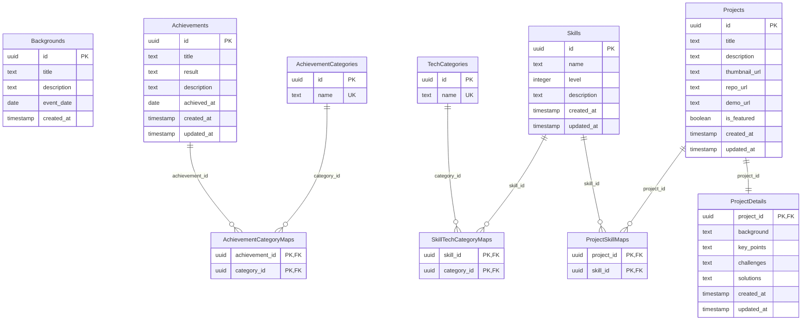

# Database Entity Relationship Diagram

## ER図

## 説明

### テーブル関係

- **Achievements ←→ AchievementCategories**: 多対多の関係。AchievementCategoryMapsテーブルを中間テーブルとして使用
- **Skills ←→ TechCategories**: 多対多の関係。SkillTechCategoryMapsテーブルを中間テーブルとして使用
- **Projects ←→ Skills**: 多対多の関係。ProjectSkillMapsテーブルを中間テーブルとして使用
- **Projects → ProjectDetails**: 一対一の関係。プロジェクトの詳細情報

### 制約

- すべてのidはUUID形式
- levelは1-5の範囲でチェック制約
- name列にはUNIQUE制約
- 外部キー制約でCASCADE DELETE設定

### 独立テーブル

- **Backgrounds**: 経歴情報を格納する独立したテーブル
